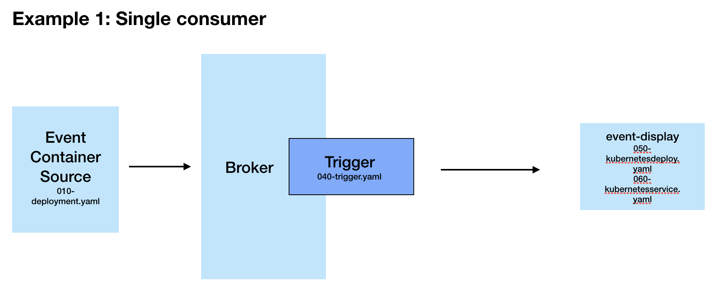
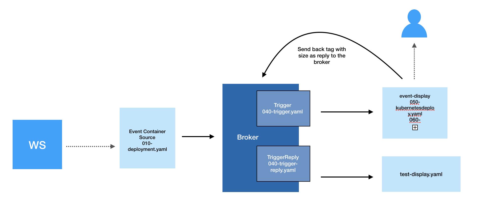
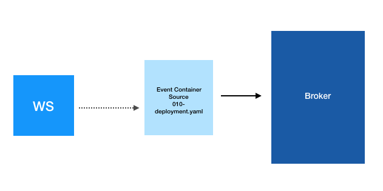
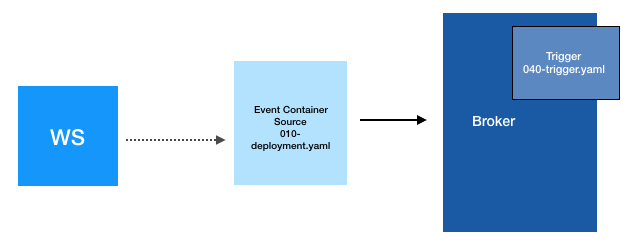
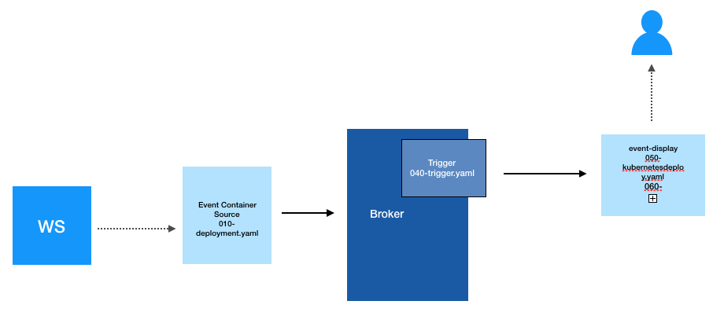
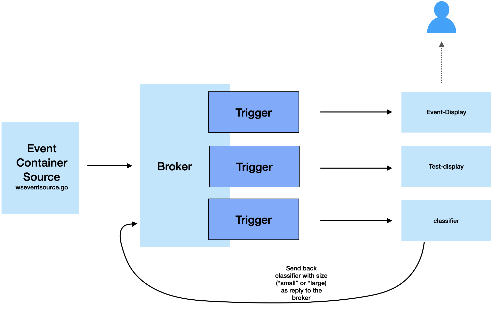

# Knative Eventing - Streaming Blockchain Transactions as CloudEvents

## Introduction

This project explores Knative Eventing. The aim of the project is to show a how a stream of events can be consumed and displayed in real-time using Knative Eventing. 

In this tutorial, you will deploy a go application that streams messages to a Knative broker. A service (event display) can subscribe to the events and they can be displayed in real time via a UI. 

The basic architecture that will be deployed by the end of this tutorial will look as follows: 



In the case where you only have one consumer/subscriber, you can also sink straight to there (in this case that would be the event-display service). 

There is also the option to have the service reply back to the broker with another event, which can then be consumed by another service from the Knative Eventing ecosystem. The architecture then looks as follows:



## Pre-requisites

The message stream source is the blockchain.info WebSocket API and sends information about new bitcoin transactions in real-time. You can find more information about this service [here](https://www.blockchain.com/api/api_websocket).

In order to run this demo, you will need:

- A Kubernetes cluster (a single node cluster running on Docker desktop is fine and is used to build this example)
- kubectl
- Istio installed (or another Gateway provider such as Gloo). You will need cluster local gateway set up (instructions can be found at [this](https://knative.dev/docs/install/installing-istio/) link).
- Knative installed as per [this](https://knative.dev/docs/install/any-kubernetes-cluster/) documentation. 


## Installing Knative

To confirm your install is complete, you can run the following command:

```bash
kubectl get pods --all-namespaces
```

You should have namespaces for `istio-system`, `knative-eventing` and `knative-serving`

You can also see the components deployed by running:

```bash
kubectl get pods -n <namespace>
```

## Building the Docker image

The Docker images are already available for each service in this tutorial, however if you want to make your own then you can build the image yourself. Each application/service folder has it's own Dockerfile.  

To build a container image, from the application folder you can run the following commands (ensure you are also logged into your image repo account e.g Dockerhub):

example to build a Docker image:

```bash
docker build -t <username>/bitcoinfrontend .
```

example to push: 

```bash
docker push <username>/bitcoinfrontend
```

## Set up a namespace with Knative Eventing enabled

The `001-namespace.yaml` creates a new namespace and also adds a knative-eventing injection label, which in turn creates a default broker. 


First, navigate to the yaml folder:

```bash
cd yaml
```

Now: 

```bash
kubectl apply -f 001-namespace.yaml
``` 

This will deploy the `knative-eventing-websocket-source` namespace and enable the knative-eventing injection. 

Verify that the default broker is ready by running `kubectl get broker -n <namespace>` and you should see that the default broker has a status of `READY=True`. 

You now have a broker within a `knative-eventing-websocket-source` namespace.

## Deploy the blockchain service that will stream messages

The `010-deployment.yaml` deploys a Kubernetes application (written in Go), which connects to the blockchain websocket stream and sends the messages to the broker.

Navigate to the blockchain-app folder:

```bash
cd blockchain-app
```

Deploy the blockchain stream service:

```bash
kubectl apply -f 010-deployment.yaml
```

You can verify messages by using the following `kubectl` command to check the logs of the app:

```bash
kubectl --namespace knative-eventing-websocket-source logs -l app=wseventsource --tail=100
```

You can also verify the broker logs:

```bash
kubectl --namespace knative-eventing-websocket-source logs -l eventing.knative.dev/broker=default --tail=100
```

You now have a service that listens for events on a websocket and then send these on as CloudEvents into the Knative Eventing broker, which is our sink:



## Deploy the trigger

`040-trigger.yaml` - This specifies that all messages that come to the default broker from our blockchain source should be sent to the Event Display service (which is not deployed yet).

Create a trigger using the following command:

```bash
kubectl apply -f 040-trigger.yaml
```

You now have a trigger:



## Deploy the Event Display service

`050-kubernetesdeploy.yaml` - This is a Kubernetes app deployment for consuming the CloudEvents and serving them at a front-end UI. 

`060-kubernetesservice.yaml` - This file defines a Kubernetes service in order to specify the requirements of our Event Display application. It includes the ports needed to run the application and also sets it to be accessible on NodePort 31234 (you can change this if you want). 

Apply both of these files using the following commands:

```bash
kubectl apply -f 050-kubernetesdeploy.yaml

kubectl apply -f 060-kubernetesservice.yaml
```

Note on UI Display:

Knative serving does not currently allow multiple ports so the Event Display part is a Kubernetes deployment (consisting of two files; 050 & 060). This is because we need to expose both 8080 (to receive the events) and 9080 (to serve the events). 

Now you have messages from the blockchain application being sent as real time events to the UI front-end service:



### See events in UI:

Head to localhost:31234 and you should see the events in the UI

### Curl the service:

Alternatively you can just curl the service from the terminal window and you should see the stream of events. 

```bash
curl http://localhost:31234/events
```


## Classify and Reply

### Deploy the classifier

The files to build your own image for the classifier service are in the classifier-transaction-size folder.

cd into the yaml/classification folder and apply the 031-classifier-service.yaml and the two triggers that are in there. 

Return to the main yaml folder. This time, our subscriber is a Knative service called test-display, which we still need to deploy.


### Deploy the subscriber for reply events and verify

`030-test-display-service.yaml` - This deploys a Knative service that will be subscribed to the reply events. It uses the Knative event-display image. 

Deploy the simple display service, which is subscribed only to the reply messages. 

```bash
kubectl apply -f 030-test-display-service.yaml
```

We can now get the logs of the test-display service and you should only see the reply messages:

```bash
kubectl logs -l serving.knative.dev/service=test-display -c user-container --tail=100 -n knative-eventing-websocket-source
```

You now have the following deployed:




 
